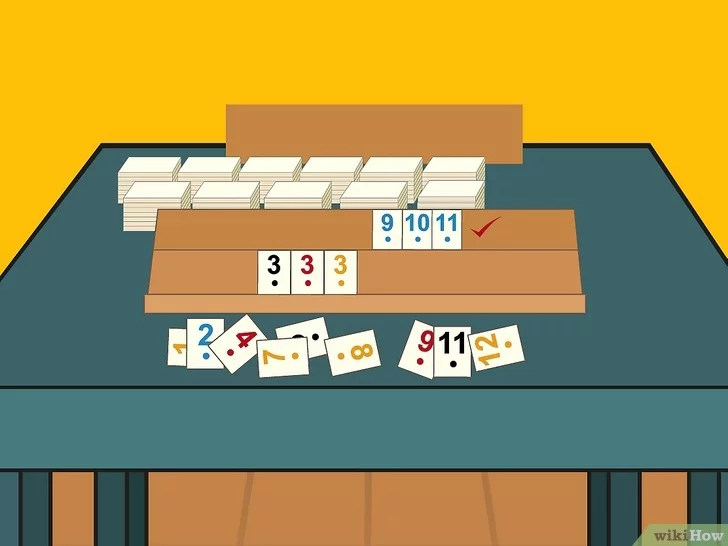
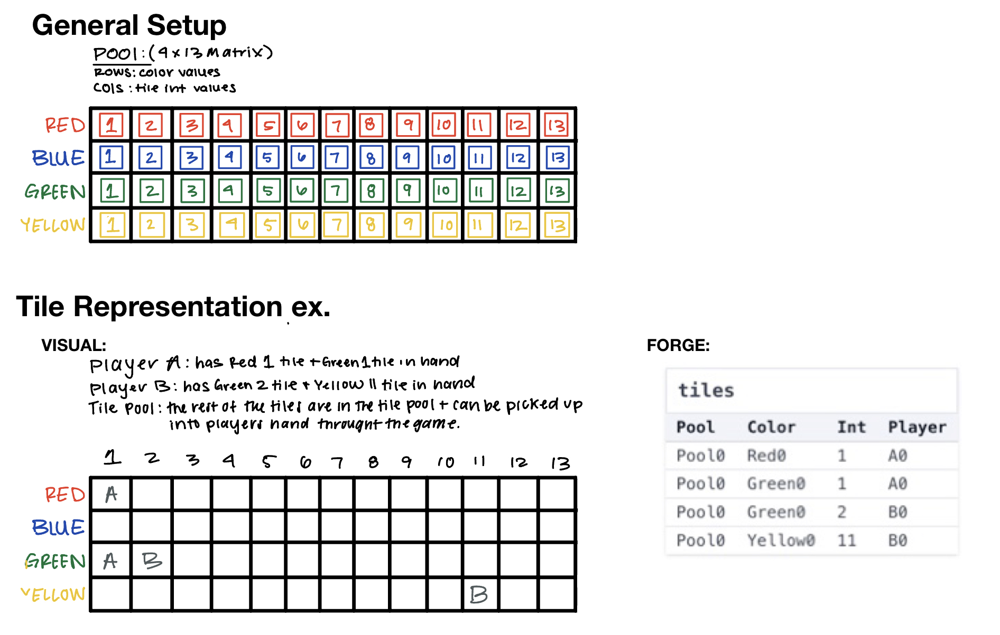

# Logic 4 Systems: Curiosity Modeling by @lmckeown and @wbednarz #
<ln/>

## Project Objective: 
### What are you trying to model? 

For this project, we choose to model a simplified version of the game of <b> Rummikub </b>. Rumikub is a tile-based game 
for 2 to 4 players and combines elements of the card game rummy and mahjong. For our modeling purposes, we wanted to focus on a 
specific rule of the game: you have to have a hand with a specific number of points to play your first turn. To model 
these 'first hand' cases in Froglet, we have made small changes to the original rules of Rummikub that will be explained in detail below. Enjoy!

### Helpful Context: Rummikub vs. Froglet Rummikub Rules and Gameplay

##### Game Setup
###### Origional Rummikub
- There are 106 tiles [1-13 red, blue, green and yellow (x2) + two jokers] [2-4 players]
- Game tiles are placed face down in on the table, each player picks up an original hand of 14 tiles and places their tiles on their rack.

###### Froglet Rummikub
- There are 52 tiles [1-3 red, blue, green and yellow] [2 players]
- Game tiles are represented by a rxc matrix where rows represent color and cols represent value. Each matrix index will be empty when the game begins.
  Players will 'pick up tiles' by placing their player name at a rxc matrix index. (ex: tiles[Red][2] = A -> player A has the Red 2 tile in their hand)
- Each player will start with 7 tiles

##### First Turn 
###### Origional Rumikub
The first player's initial move must meet certain requirements:
-- The player must place tiles on the table that have a total value of at least 30 points.
-- The tiles placed on the table must form valid set.
-- The initial meld can consist of one or more sets or runs.

###### Froglet Rummikub
The first player's initial move must meet a certain requirement:
-- The player must place tiles on the table that have a total value of at least 15 points.
-- The tiles placed on the table must form either a single valid set. 

##### What is a valid set?
A valid set is a group or run of tiles
--<b>RUN</b>: a set of three or more consectutive numbers all in the same color.
--<b>GROUP</b>: 3 or 4 tiles that have are the same value and are different colors.

To view the full rules of the game please visit [this](https://rummikub.com/wp-content/uploads/2019/12/2600-English-1.pdf) site. 

### Our BIG Question
A big part of the game Rummikub is the aspect of manipulation, when both players have been able to play their first hand, they can add to or restructure 
the tiles on the board when attempting to play all the tiles in their hand. Modeling this idea of manipulation is complex; however, modeling first turn scenarios
which start this process is an important step to understanding modeling the full game. The purpose of this project is to get a better understanding of these first-turn 
scenarios, which can happen at any point in the game after the original hand tiles are chosen!  

<ln/>

### Model Design and Visualization: 
#### Model Design Choices

###### Rummikub
In the Rummikub game, game tiles are placed face down on the table in a 'tile pool'. Players then randomly choose tiles and place the tile on their 'tray' to represent their hand. This setup is visually shown in the image below

###### Froglet Rummikub
To model this setup in Froglet Rummikub, we use an n (color) x m (value) matrix to represent all the tiles in a game. Within the matrix, if a specific color+value tile has nothing at its rxc position [pool.tiles[color][value] = null], the tile is in the 'tile pool'. If the rxc position has a player in the position [pool.tiles[color][value] = B] or [pool.tiles[color][value] = A], the tile is in the perspective player's 'tray' or hand. A visual representation with a sterling visualizer example in Forge/Froglet is provided below. This example explains how to interpret the Sterling visualizer output. 

#### Run Statements 
There are three run statements, each which model a unique aspect of our Rummikub game. 

###### Run Statement 1
Run statement #1 finds a scenario for which there is a wellformed, balanced board that for some min value requirement player A can play a hand and player B cannot. 

###### Run Statement 2
Run statement #2 finds a scenario where player A and B have just drawn their first 7 tiles from the pool. 

###### Run Statement 3
Run Statement #3 finds a scenario where there is some pre-board where player A can't play their first hand, they draw a new tile, 
and in the post-board scenario player A can play their first hand.

###### Run Statement 4 
Run Statement #4 finds a scenario where both players A and B can play their first hand down from their original 7-card hands. 

###### Run Statement 5 
Run Statement #5 finds a scenario where both players A and B can play their first hand, however, it does not have to come from their original 7 hands they can have drawn more tiles

NOTE: for this project, we did not create a custom visualizer

### Signatures and Predicates: 
We have 3 defined sigs and 11 predicates that make up our Rummikub game. They are all documented in detail in the two_player_rummikub.frg but we give a quick overview of the functions here. 

###### Sigs
- the player sig is abstract and we define two game players; player A and B
- the pool sig has a tiles field and represents the tiles used in the game and the game board 
- the color sig is abstract and represents the tile colors. We define 4 tile colors; Red, Blue, Green, and Yellow.

###### Game Board Predicates 
- wellformed: wellformed rules out garbage board options that have row and col values that are less than 0
- validTiles: takes in a p, pool and ensures that a tile is either claimed by one or no players. This ensures that two players do not have the same tile during gameplay.
- init: takes in a p, pool and declares an empty 4x13 matrix to start a game - all the tiles are in the pool 'turned over' in this scenario
- origionalHand: takes in a p, pool and declares a situation where each player has chosen their original 7 tiles from the pool

###### Player Action Predicates 
- playableSet: takes in three color, value pairs and determines if they make a playable set or run; a run is a set of three or more consecutive numbers all in the same color and a set is 3 or 4 tiles that have the same value and are different colors.
- canPlayFirstHand: takes in a p, pool a player, Player, and a minminimumValue, Int and determines if the player has cards in his hand that satisfy the Rummikub first-hand requirements - that is they have a playableSet that add up to the minminimumValue input. 
- drawNewTile: takes in a pre, post, Pool, a player, Player a color, Color and a value, Int, and adds the specified (c, v) tile to the player's hand.  

###### Additional Helper Predicates 
- consecutiveNumbers: a helper function for canPlayFirstHand that takes in three values and determines if they are consecutive
- aturn, turn, and balanced: these predicates all take in a p, pool and are used to ensure that in a pre-first-turn game, each player has the same number of tiles and the game is 'balanced'. These predicates were taken from the in-class tic-tac-toe example.

### Testing:  
We comprehensively tested each predicate to ensure our game was working as intended. At a high level, we used test expect blocks and assert statements to check for edge cases and expected behavior. More specific info relating to each predicate can be found in the rummikub_test.frg file. 
